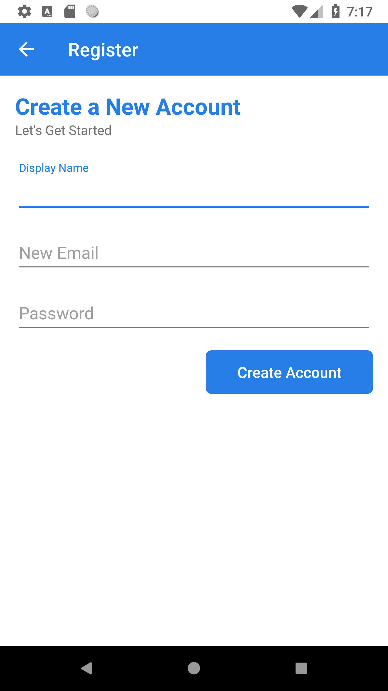
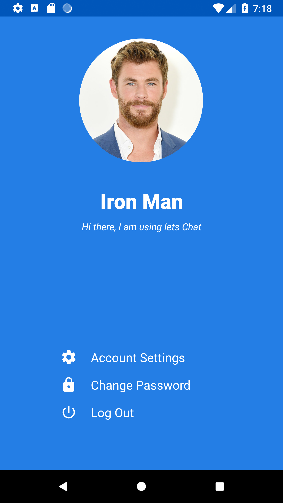
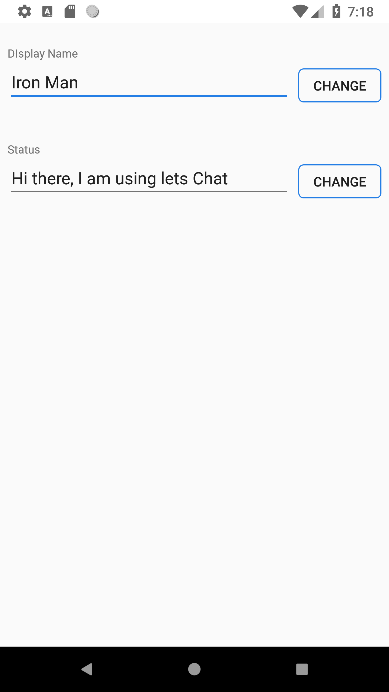

# LapitChat

Chating App(currently in progress)

Firebase Based application

Key Features :

--Sign Up using Email

--Change Account Profile And Name

--Set/Change Status

--Change Password

library Used : 

Circle Image View (https://github.com/hdodenhof/CircleImageView)

Glide Library (https://github.com/bumptech/glide)

Image Compressing Library (https://github.com/zetbaitsu/Compressor)

Gradle :

Min SDK Version : 21

Targe SDK Version : 28

screenshots :

